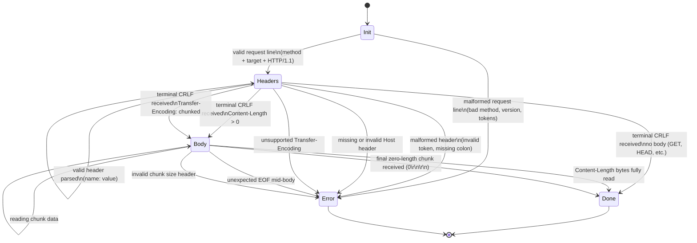

# Parser State Machine

The request parser is implemented as an explicit finite state machine. Each call
to `parse(data []byte)` advances the machine by one state at most, returning the
number of bytes consumed. The machine is re-entered on every `conn.Read` until
it reaches `Done` or `Error`.

## State Diagram

## State Descriptions

**Init**
Entry state for every new connection. The parser scans for the first `\r\n` to
extract the request line. If no `\r\n` is present yet, it returns 0 consumed and
waits for more data. Transitions to `Headers` on a valid request line or `Error`
on any malformed token.

**Headers**
The parser scans line by line, splitting each on `:` to extract name/value pairs.
Each name is validated against the RFC 7230 token alphabet. The state loops on
itself until the terminal empty line (`\r\n`) is received. On that line, it
validates the `Host` header and inspects `Content-Length` and
`Transfer-Encoding` to determine the next transition.

**Body**
Two sub-modes share this state:

- _Content-Length mode:_ reads exactly N bytes as declared in the header.
  Transitions to `Done` when N bytes have been consumed.
- _Chunked mode:_ reads a hex chunk-size line, then that many bytes of data,
  repeating until a zero-length chunk signals the end of the body.

**Done**
Terminal success state. `req.done()` returns true. The outer read loop in
`RequestFromReader` exits and the `*Request` is returned to the caller.

**Error**
Terminal failure state. The parser sets an internal error and returns it to
`RequestFromReader`, which releases all pooled resources and returns the error
to the connection handler. The connection is closed.

## Key Invariant

The state machine never moves backward. `parseIndex` only advances forward
through the read buffer. A transition to `Error` is permanent for that
connection — there is no recovery or retry within a single request lifecycle.
